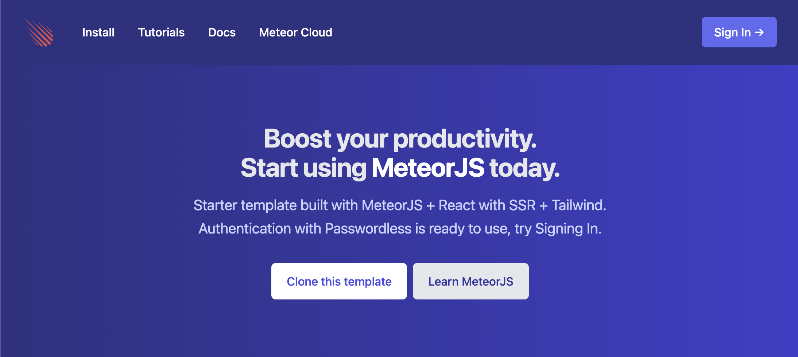
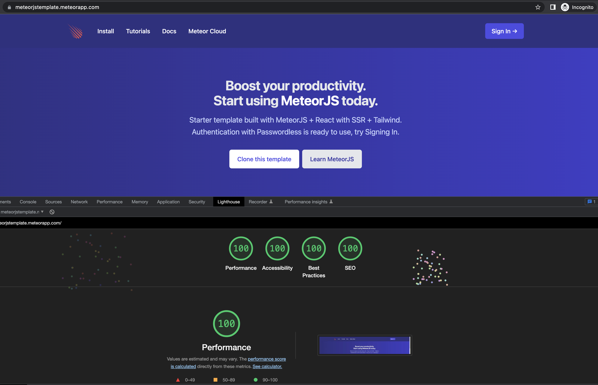

# MeteorJS template

Check the deployed Demo App: [https://meteorjstemplate.meteorapp.com/](https://meteorjstemplate.meteorapp.com)

Start your [MeteorJS](https://meteor.com) project with this template if you want to use React with SSR and TailwindCSS.

## What is it?

It's a template project ready for you to implement your business idea. It includes:

- sign-in using email (passwordless)
- router setup with SSR
- basic styles
- email system
- 100 Score on Lighthouse

### Dependencies

#### Npm packages for React

- react
- react-dom
- react-router-dom
- react-helmet

#### Npm packages for TailwindCSS

- tailwindcss
- @headlessui/react
- @heroicons/react

#### React packages

- [react-meteor-data](https://github.com/meteor/react-packages/tree/master/packages/react-meteor-data)

#### SSR packages

- [react-router-ssr](https://github.com/Meteor-Community-Packages/react-router-ssr)

#### Authentication packages

- [quave:accounts-passwordless-react](https://github.com/quavedev/accounts-passwordless-react)

#### Email packages

- [quave:email-postmark](https://github.com/quavedev/email-postmark)

### Set up your project

#### Inform your app info
- Fill the fields inside the `./private/settings.dev.json` in `public.appInfo` to make sure your app works properly.

#### Sending emails with Postmark

- Create a [Postmark account](https://postmarkapp.com/signup) 
  - Replace the `YOUR_API_TOKEN` property with your postmark API KEY in the settings file.
- Follow the steps to verify your domain in their website
  - Replace the property `YOUR_FROM_EMAIL@yourdomain.com` with your desired `from` for the emails in the settings.
- Locally, in you dev environment, you can see the generate token in the logs.

#### Deploy on Meteor Cloud

Create an [Meteor Cloud account](https://meteor.com/cloud) and start deploying for free.
Option 1: Use Push to Deploy to deploy from GitHub.
Option 2: Use the CLI and run `meteor npm run deploy`. Remember to change the domain name in the command that is located inside the `./package.json` file.

## Updating your project

Follow our changes reading our [CHANGELOG](CHANGELOG.md).
